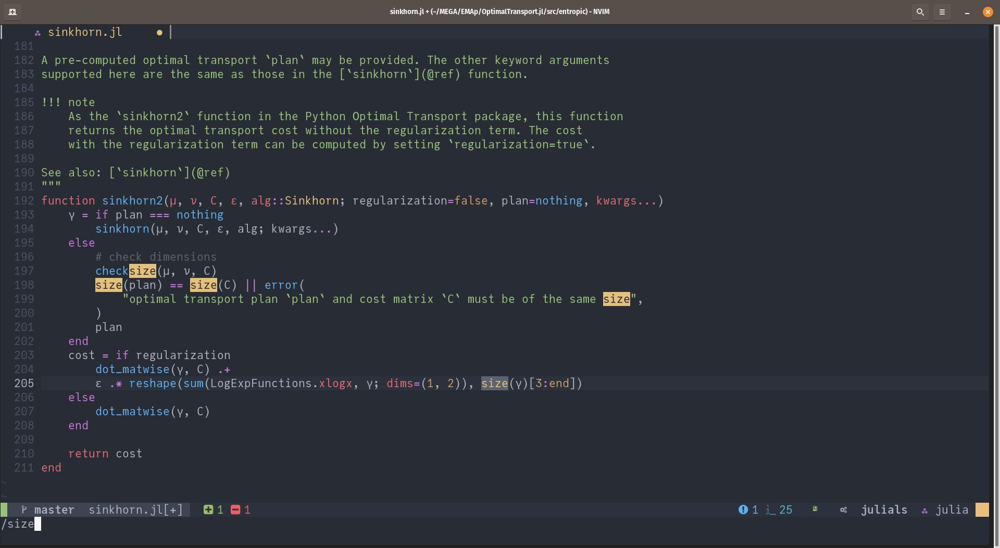

# LunarVimConfig

This repo contains my configuration for
[LunarVim](https://www.lunarvim.org/).
The focus was to create an IDE for Julia, although
it can be adapted to any other language by installing the appropriate plugins.

[This blog post](https://medium.com/coffee-in-a-klein-bottle/vim-for-julia-another-look-1dc4265bb49b)
is reposted here and presents a quick overview on how to use
LunarVim and set it up for Julia.


---


# Vim for Julia - Another Look
## LunarVim as a Julia IDE
In the past, I wrote on how to use Vim for Julia. Recently, I've changed my setup and I've been using the new and amazing LunarVim. Here is a brief tutorial on how to setup Vim (actually Neovim) as your Julia IDE.
### Introducing LunarVim
The first question to be answered is, what is LunarVim? Presto!

LunarVim is an opinionated, extensible, and fast IDE layer for Neovim >= 0.5.0. LunarVim takes advantage of the latest Neovim features such as Treesitter and Language Server Protocol support.

In simpler words, it's a series of default configurations for Neovim that makes it even more amazing. The first requirement to use LunarVim is to install Neovim with version at least 0.5. Unfortunately, the sudo apt install neovim will not work (at the time I'm writing this), because the version installed will be lower than the required one.

An easy way to install a proper version is to add the PPA for the unstable version and install it. Here are the easy steps:
```julia
sudo add-apt-repository ppa:neovim-ppa/unstable
sudo apt update
sudo apt install neovim
```
To install LunarVim, just run:
```
bash <(curl -s https://raw.githubusercontent.com/lunarvim/lunarvim/master/utils/installer/install.sh)
```
By running the command lvim in your terminal, LunarVim should start! You can always add alias vim = "lvim" to your .bashrc , to run LunarVim instead of vim.

### Setting up Julia

Now that you've got LunarVim working, let's setup the Julia language. This is actually surprisingly simple. In your terminal, run the following:
```
julia --project=~/.julia/environments/nvim-lspconfig -e 'using Pkg; Pkg.add("LanguageServer")'
```
This installs the Language Server Protocol (LSP) for Julia, i.e. the auto-completion functionally for Julia. Now, every time you open a ".jl" file, just wait a bit and the LSP will start.

Next, let's install the Julia-Vim package that will enable us using Unicode, thus, by writing something like \alpha and pressing tab, we'll get the alpha Unicode, which is allowed in Julia. To do this, go to your LunarVim configurations file, which can be accessed by running lvim in the terminal and selecting the Configuration option. Another way is to open the configuration file directly, which is ~/.config/lvim/config.lua .

Inside the configuration, there is a place where you can easily install any plugin you want. Just navigate to where the "- - Additional Plugins" is. Originally, everything should be commented. Just uncomment the necessary lines, and write {"JuliaEditorSupport/julia-vim"} and save. This will prompt the installation of the plugging. Take a look at the figure below.


This is what your configuration should look like to install Julia-Vim. Note that you can add any other plugins you like.

**Word of Caution!**

Since Vim is inside your terminal, you need your terminal to have a font with Unicode enabled. I suggest you install JuliaMono, a beautiful font created for Julia :D. Once the font is installed, just go into your terminal configuration and change to it.

Even with Unicode font enabled, in my notebook, the Julia-Vim was still freezing after pressing Tab without any text. To solve this issue, I wrote the following two commands in my LunarVim configuration:

```
vim.cmd("let g:latex_to_unicode_tab = 'off'")
vim.cmd("let g:latex_to_unicode_keymap = 1")
```


Screenshot of my own configuration file.Now everything should be working beautifully!
**Your new LunarVim IDE for Julia is ready to be used.**

---

###  Fast Course on LunarVim + Julia
You can now read the documentation on LunarVim to better understand some of the default settings. But, I'll give some tips on how LunarVim works, and how to use it with Julia to run your code. Here is a (very) fast course on some of the main commands for LunarVim:


* In LunarVim, your <leader> is the space , hence, many short cuts will be composed of pressing "space" followed by something else. Here is where LunarVim comes shining. If you just press "space" and wait a bit. A menu will pop-up from below, showing possible commands.


* LunarVim comes with "NerdCommenter" plugin, which allows you to navigate with a menu. Just press <space>+e .


* Once you open another file, a buffer is created and shown in the top of the screen . You can click on the tab to change buffers, or you can press shift+h or shift+l to change buffers.


* Press ctrl+w to see the commands related to splitting screen and moving between screens. You can press ctrl+ h,l,j,k to move between windows.



* As in regular Vim, you can press / to start searching and then space+h clears the highlighted terms in the search.


* When you open a Julia file, you just need to wait a bit for the LSP to start working. Once the LSP is loaded, auto-completion will be working, and many other helpful features, such as visualizing the docstring of a function. For that, press g and a window will pop-up with many shortcuts related to the LSP. For example, you can press g + p to take a peek at the docstring and g + d to actually open the function definition in another buffer. Look the figures below.


* Lastly, you can press ctrl+t to open and minimize a floating terminal. Once this is done, you can run the Julia REPL and copy/paste every line of code you want to run.

There are many other helpful commands. Check-out the documentation on LunarVim or try them out by yourself to learn more. Hope this was helpful.

### *EXTRA*
Some extra notes on the configuration.
Lsp comes with several pre-set configurations, which
might be quite annoying. For example,
when altering `latex` files, there will be
snippets to things like `.` or `,`, which
autocompletes every time you press Enter. Thus,
one can manually disable them by going to
`/.local/share/lunarvim/site/pack/packer/start/latex.json`
and commenting out the referred snippet.

When enabling autopairs, another annoying configuration is the completion for '$'
which doesn't allow you to properly delete the dollar sign.
You can go to
`~/.local/share/lunarvim/lvim/lua/core/autopairs.lua`, and comment
the line `:with_del(cond.not_after_regex_check "xx") -- disable  add newline when press <cr>`.
